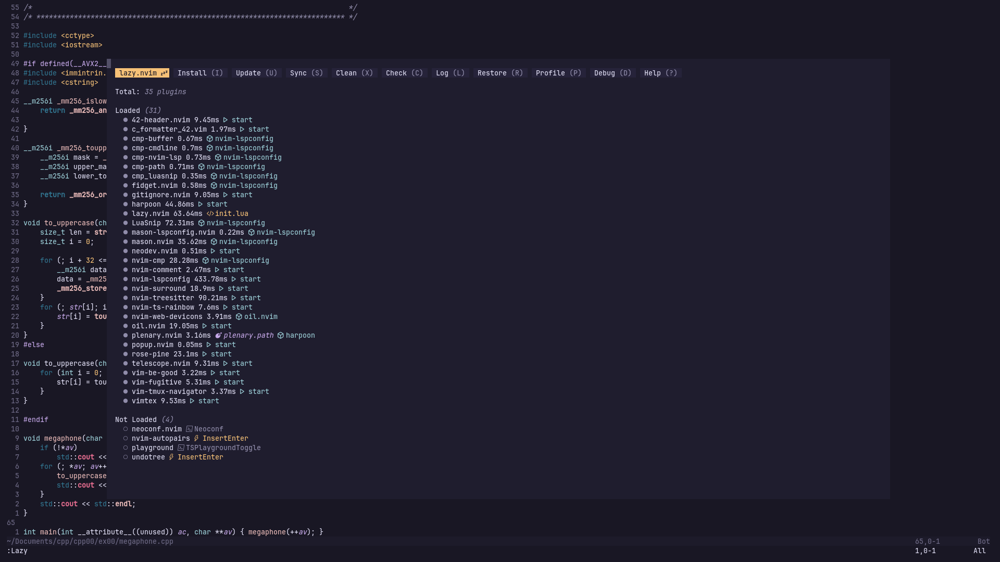

# My Neovim Configuration 🚀

Welcome to my Neovim configuration repository, tailored for 42 students and designed for efficient low-level development in C/C++. This lightweight setup is optimized to provide a seamless coding experience with essential plugins and configurations suitable for resource-constrained environments. 🛠️🎨



## Features 🌟

- **Lazy Loading:** Configurations are optimized for performance with lazy loading of plugins using `lazy.nvim`.
- **Enhanced Key Mappings:** Streamlined shortcuts to maximize productivity and ease navigation.
- **Visual Enhancements:** Includes the elegant `rose-pine` theme, optimized for both light and dark modes.
- **LSP and Autocompletion:** Full setup for Language Server Protocol (LSP) support and smart autocompletion.
- **Developer-Friendly Utilities:** Tools like `vim-fugitive` and `nvim-comment` integrated for an improved Git and coding experience.
- **42 School Header:** Automatically adds the 42 header to your files using `42header.nvim` with the shortcut `<leader>11`.
- **C Formatter (Optional):** If enabled, integrates `c-formatter-42` for consistent C/C++ code formatting, accessible via `:CFormatter42` command.
- **Navigation Enhancements:** Utilizes `oil.nvim` for improved file navigation, including a shortcut `-` to quickly move to parent directories.
- **Undo Management:** `undotree` managed with `<leader>u` to navigate changes and coding history.

## Installation 📦

1. Clone the repository to your desired location:
   ```
   git clone https://github.com/bonsthie/nvim ~/.config/nvim
   ```
2. Start Neovim and the plugins will be installed automatically on first run, thanks to the `lazy.nvim` setup.

## Usage 📘

### General Key Mappings:

- `<leader>pv` - Open project files.
- `<leader>gd` - Go to definition.
- `<C-d>` and `<C-u>` - Scroll down and up with centering.
- `<leader>s` - Quick substitution in the current word.
- `-` - Open parent directory with `oil.nvim`.
- `<leader>u` - Toggle the undo tree with `undotree`.

### 42 School-Specific Key Mappings:

- `<leader>11` - Insert or update the 42 school header with `42header.nvim`.
- `:CFormatter42` - Format code according to 42 norm (if the plugin is enabled).

### **Command for sharing code** *-brought you by [adjoly](https://github.com/keyzox71)*
  - ```:W``` - Copy entire file to wastebin with ```wastebin.nvim```
  - ```:'<,'>W``` - Copy current selection (just tap "**:**" when you have selected text)

## Customization 🔧

You can customize various aspects by editing the custom folder located in the `lua` folder. Each file is segmented to handle different configurations like key mappings, plugin setups, and appearance settings.

For more detailed instructions and advanced configurations, check out the [Wiki](https://github.com/bonsthie/nvim/wiki).

Happy Coding! 💻🌈


